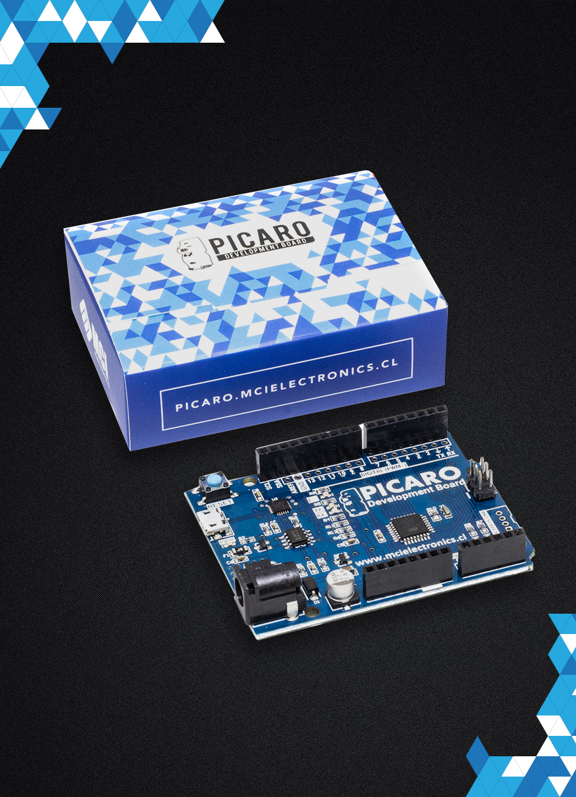
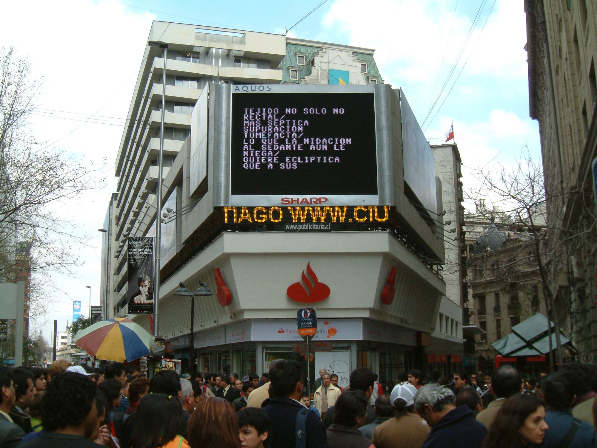
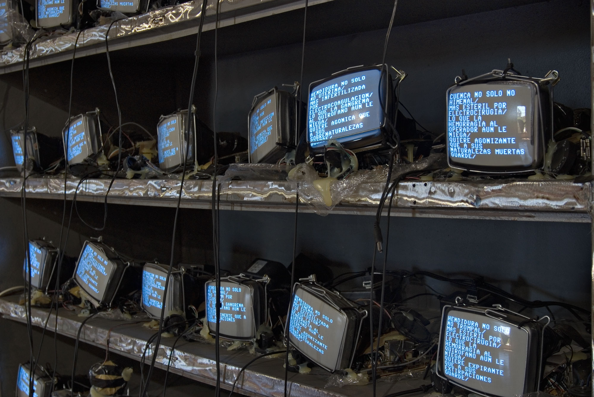
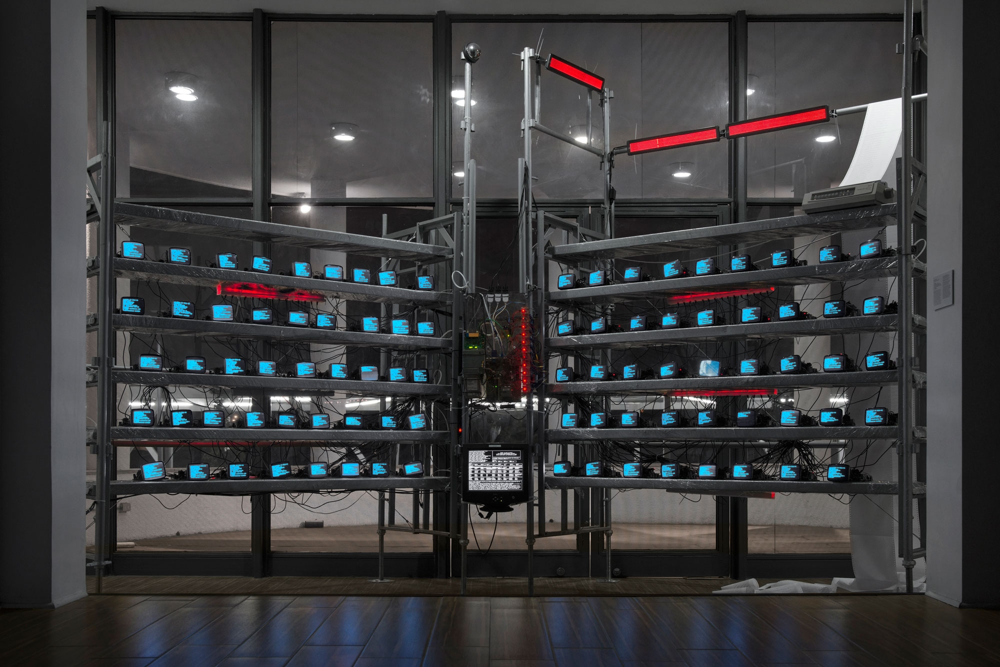
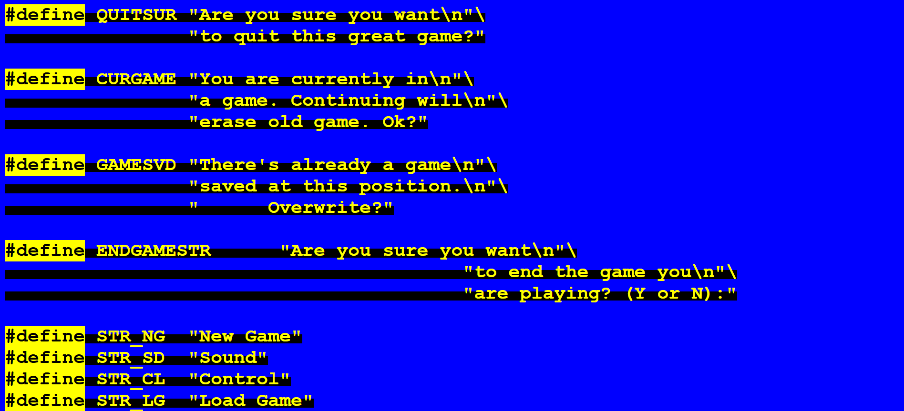
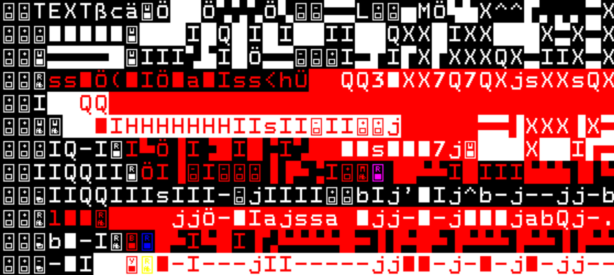
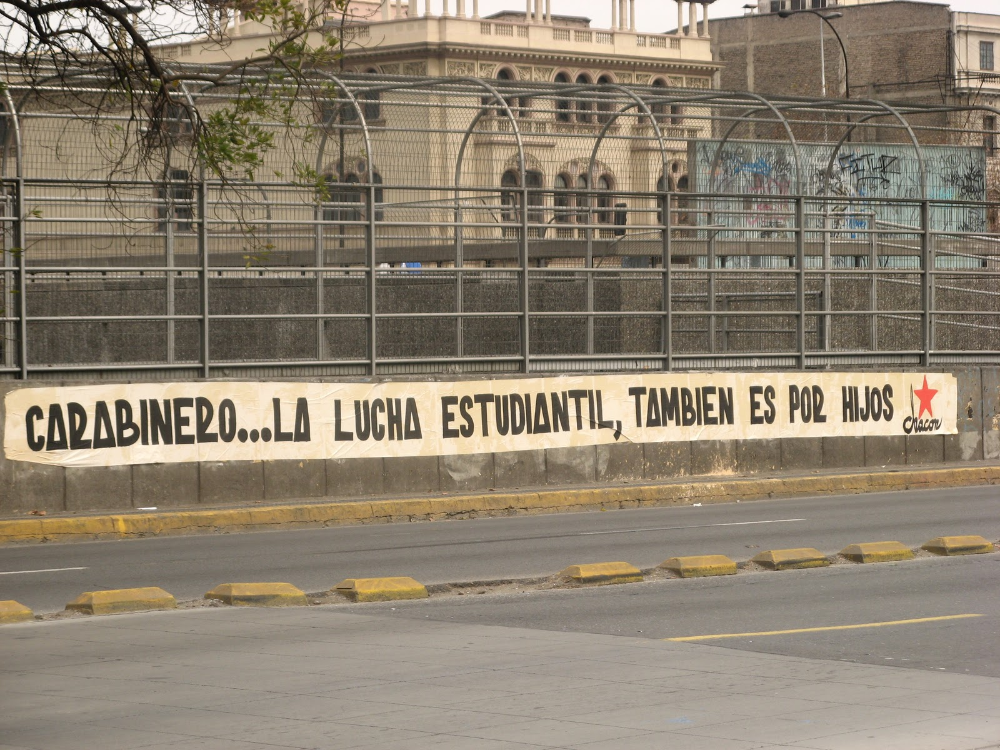

# Clase 01 / 07.08.2025 #

## Resumen ##
En esta primera clase Mati nos presentó a grandes rasgos el curso de electrónica de este semestre, en el cual nos aventuraremos a la exploración de códigos, poniendo en tensión las sencibilidades creatívas de la producción artístia; con la idea del dato.

Para la realización de nuestra bitácora obligatoria del curso utilizaremos GibHub, una plataforma pública para el almacenamiento específico de códigos abiertos, un espacio que nos permite el respaldo de información y el trabajo colectivo. En lo personal me parece un espacio sumamente interezante de explorar, y espero mis conocimientos básicos de html5 y Css me permitan trabajar de la mejor manera en la interfaz.

Tras una pequeña introducción sobre la historia de los micro-controladores, Mati nos presentó variedad de referentes, a continuación aquellos que más relevantes me parecen:

### Referentes ###

Arduino Pícaro:

Arduino Pícaro es una alternativa creada en Chile a la placa de control "Arduino Uno". Me parece particularmente interezante la utilización de iconografía local en su diseño, aún más al tratarse del "Indio Pícaro", un pocisionamiento sarcástico sumamente atractivo.

Aarón Montoya:

"It´s Ok" es el exámen final del magister de Aaron en el MIT, una propuesta de ejercicios utilizando electrónica y progamnación variados bajo la premisa de reconocer emociones, acciones y procesos, por ejemplo "It´s Ok to Die", una pantalla con un contador en reversa que recuerda a Aaron cuanto falta para llegar a los 75, el año promedio de fallecimiento en Chile.
La obra de Aaron me parece particularmente atractíva por su propuesta metodológica, mi plan es también realizar una serie de obras bajo una misma premisa para mi exámen de título, en mi caso, desplazado a la fotografía, la intervensión y la política local.

### Evaluaciones ###

Algo importante que revisamos esta primera clase fué la candelarización y evaluaciones que tendremos en el curso, el cual consiste en:

**1: Resolución de problemas**
Una primera nota donde se evaluará la efectividad del circuitaje y código que vayamos a trabajar en la clase.

**2: Proyecto Creativo**
En esta segunda nota ya debe proponerse las maquetas iniciales de un proyecto artístico con mayor complejidad.

**3: Avance de Proyecto Final**
Una nota de pre-montaje para la obra que estemos realizando como exámen final del curso, donde se pueda afinar detalles y robustecer la propuesta final.

**Exámen final** 
La última nota del curso, una revisión del proyecto realizado en clases con una comisión de profesores externa al curso.

## Encargo 01 ##

Como primer encargo del curso, Mati nos propone que, además de configurar nuestra bitácora en GitHub, podamos presentar al curso 2 referentes, uno que se relacione con la diciplina del curso (por ejemplo, artístas mediales), y otro referente específico de texto (un escritor, una palabra, un texto, etc).

### Referente Medial ###
**Máquina Cóndor** de Demian Schopf.

Revisando mi lista de referentes me costó encontrar alguno que representara de mejor manera mis intereses dentro del curso, en el arte medial la mayoría de artistas que conozco se destacan en el Net.Art, aquellos que su obra habíta la interfaz Web, pero no siempre involucran la electrónica.
A partir de este interés por habitar la red me vino a la mente los modelos relacionales construidos por el artista Chileno Demian para la programación de su obra "Máquina Condor". Este trabajo tiene varias versiones a lo largo de los años, pero la premisa es siemrpe la misma, crear algoritmos con bases de datos especificos (Noticias, Datos especificos respecto a la Operación Condor y otras intervenciones políticas del estilo en américa latina, textos, etc) para generar estrofas y poemas abtractos en tiempo real.
Estas estrofas muy inspiradas en la antipoesía de Nicanor Parra se muestras atravez de complejos sistemas de pantallas en la mayoría de veces, pero mi favorito es una intervención en una pantalla publicitaria en el centro de Santiago, mi atracción a esta acción específica es debido a que la intalación e intervensión en el espacio público es de mis intereses mas fuerte.

 
 
 

**Jodi.org**

Jodi.org es un proyecto artístico de un duo de Bélgico que explora el Net.Art desde el glich y el error informático.

 
 

**A G A T H A  A P P E A R S** de Olia Lialina.

Olia Lialina es una artísta Russa, una de las referentes màs importantes del Net.art a nivel global. Mi interés personal con Olia viene desde su concepto de "Net.Film", una forma que eleva Olia para narrar historias en el internet que no utiliza la web solo como soporte, sino también como elemento clave en el modo de contar.
"Agatha Appears" es una obra particular de Lialina que mezcla las reflecciones políticas de la sexualidad femenina y el imaginario web, un equilibrio interesante que me gustaria seguir explorando.

### Referencia de Texto ###
**Chacón**

El Partido Comunista de Chile tiene un tipo de propaganda política muy particular, papelografos blancos o cafés con una tipografía y firma particular que son pegados en el espacio público con frases que responden a la contingencia nacional. 
Me parece particularmente atractivo este medio debido a una profunda disyuntiva personal al rededor de estas acciones, por un lado, comprendo el valor histórico del papelógrafo, tiene una mística particular, un voto de confianza política y de seguridad; aún así, vivimos en una ciudad que cada día se llena de más estímulos, haciendo que el propósito original del papelógrafo se pierda por completo, un susurro que pasa completamente desapercibido en una metrópolis bulliciosa. Esta terquedad de no querer innovar y la fetichización del método por mera nostalgia refleja también el decaimiento del discurso de la izquierda nacional.

 
 
