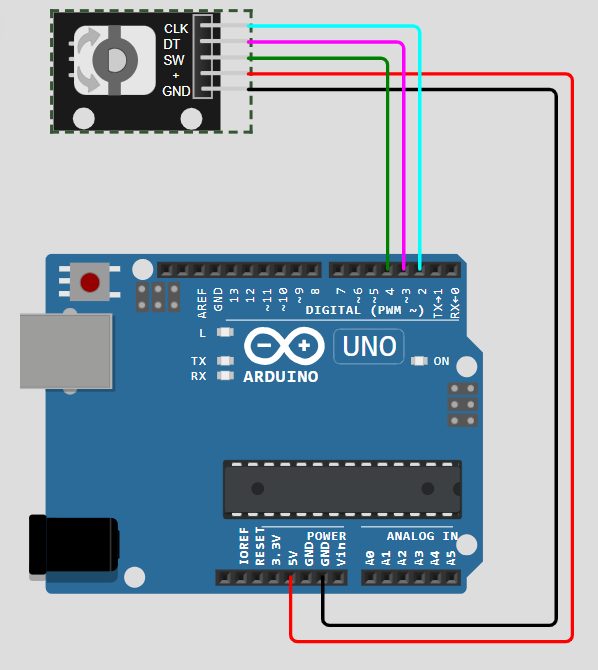
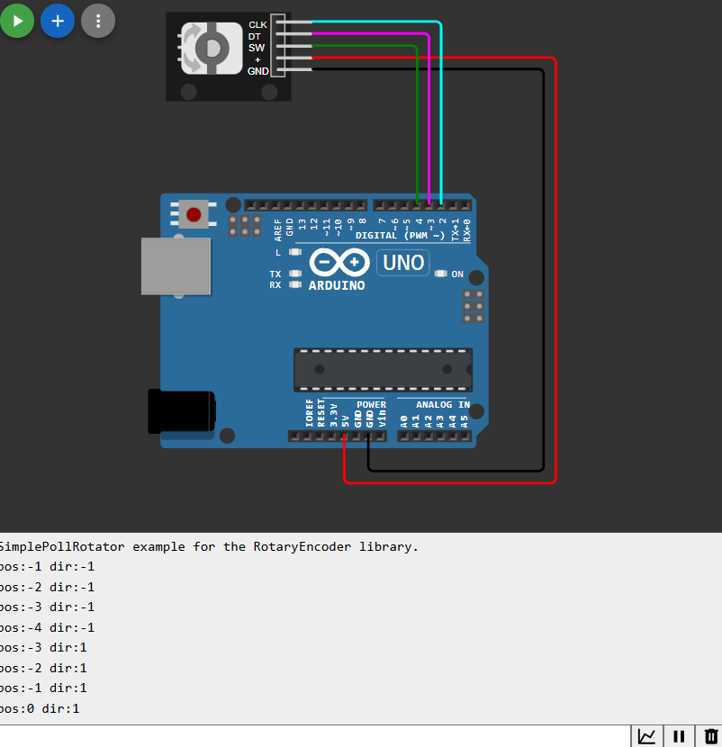

# Clase 07 / 02.10.2025

## Introduccion

Para comenzar, Mati rcuerda que la clase pasada no tuvimos encargo para realiz fuera de clases, por lo que esta clase haremos un encargo durante la clase de forma autónoma.

Mati nos precenta lo que es un **"ENCODER ROTATORIO"**, este tiene un giro infinito y tiene un click (similar a un joystick). Su diferencia con el potenciometro es que este **no es una reistencia variable.**

Al no tener mi propio encoder, utilizaré el sitio web [WokWi](https://wokwi.com/projects/new/arduino-uno) donde puedo simular la codificación de arduino en internet.

## Encoder Iniciación

### Paso 1

Para conectar el Encoder al arduino es necesario conectar cada pin de la siguiente forma:

1: Gnd a Gnd    2: + a 5V   3: SW a 4   4: DT a 3   5: CLK a 2



### Paso 2

Lo siguiente es descargar la librería "RotaryEncoder" de Matthias Hertel.

### Paso 3

Utilizaremos como base el codigo de ejemplo que trae la misma libreria llamado "SimplePollRotator"
Este es el código con las variaciones hechas por Mati para enseñarnos:

```cpp
#include <Arduino.h>
#include <RotaryEncoder.h>

#if defined(ARDUINO_AVR_UNO) || defined(ARDUINO_AVR_NANO_EVERY)
// Esta es la dfinición de los Pines, usamos los digitales
#define PIN_IN1 2
#define PIN_IN2 3

#elif defined(ESP8266)

#define PIN_IN1 D5
#define PIN_IN2 D6

#endif


RotaryEncoder encoder(PIN_IN1, PIN_IN2, RotaryEncoder::LatchMode::TWO03);

void setup()
{
  Serial.begin(2900);
  while (! Serial);
  Serial.println("SimplePollRotator example for the RotaryEncoder library.");
} 


void loop()
{
  //Cuando declaramos variables les damos un valor inicial, cuando lo 
  //hacemos en "Static" la define localmente dentro del loop y solo la primera
  //vez vale 0
  static int pos = 0;
  //Esta es la función más importante de todo el código
  //Sin esta función no funciona
  encoder.tick();

  int newPos = encoder.getPosition();
  if (pos != newPos) {
    Serial.print("pos:");
    Serial.print(newPos);
    //Si newpos pasa de 0 a 1 saca una nueva dirección de la bibliotéca
    Serial.print(" dir:");
    Serial.println((int)(encoder.getDirection()));
    pos = newPos;
  } 
} 
// Fin
```
Sabemos que este código funciona gracias a nuestro Serial Print.




## Encargo 07

Con el conocimiento adquirido, **utilizremos Processing para que nuestro Encoder manipule la pantalla.**

Al estar trabajando en WokWi deberé investigar primero como conectar De un sitio a otro, o reemplazar el Encoder con un potenciometro, pero esa será mi última opción, quiero aprender a usar encoder, me paece interesante y útil.

Luego de intentarlo muchas veces (reemplazando processing por p5.js o utilizar Python, pero no terminé de entender como hacerlo) no pude hacer que funcionara, así que lo compraré y lo haré en casa con mayor tiempo

## Encargo 07.5 (opcional)

Controlar la velocidad con el Encoder  

