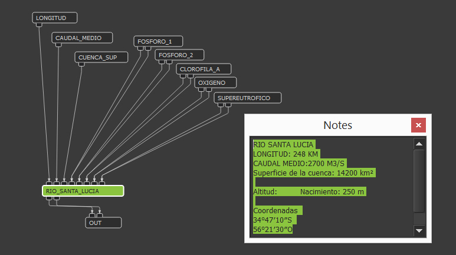
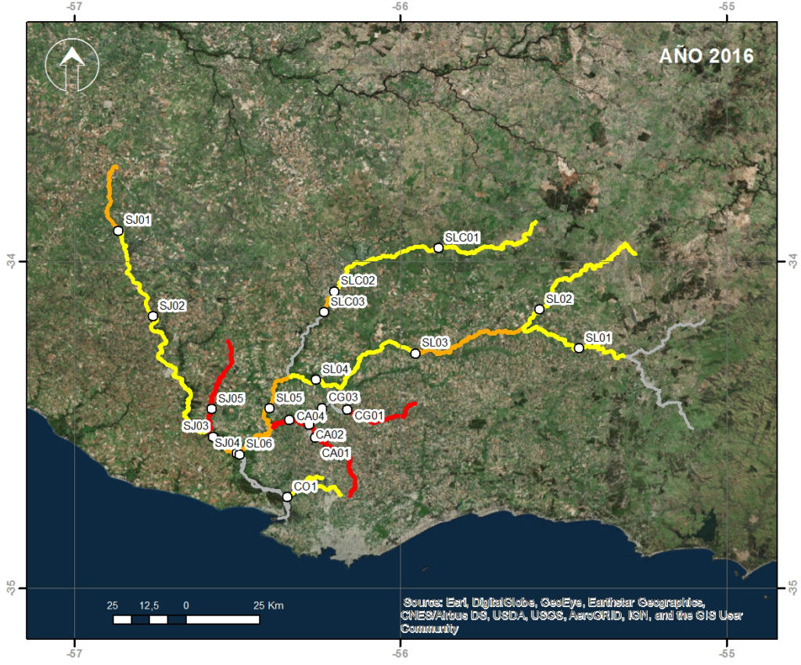
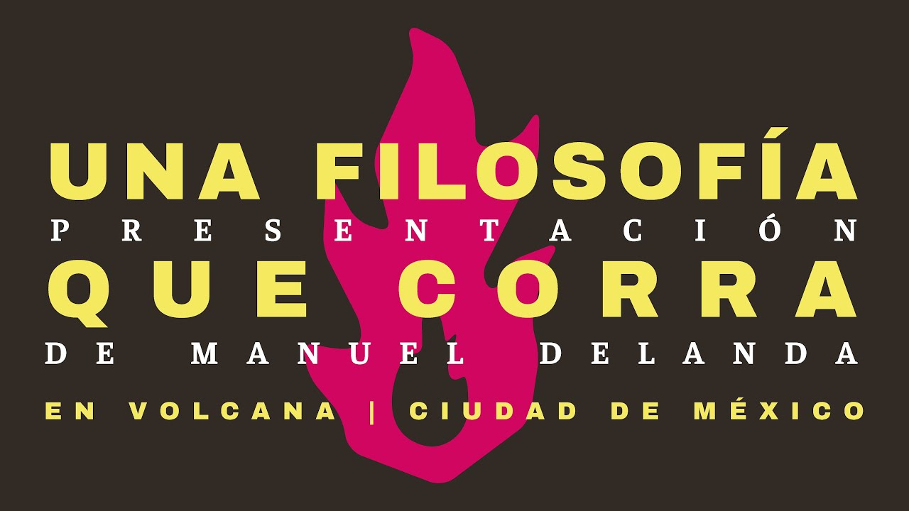

# Clase 08  /  16.10.2025

## Resumen
Para comenzaqr la clase, hacemos una revisión de fechas teniendo en cuenta las oficiales que bajó dirección. 
El exámen para mi queda en la semana del 21.11

Posterior a esto, comenzamos a hablar sobre el arte basado en datos, y para ello es necesario entender que es la visualización de datos, el proceso de recoger información y aprender a mostrarlo de la mejor manera.

Un encargo que Mati nos dejó para la semana en que no tuvimos clase fue utilizar la app [**Sensor Logger**](https://sensorlogger.co.uk/) para grabar nuestro recorrido por gps, posterior a esto utilizamos [**My Maps**](https://www.google.com/maps/d/u/0/?hl=es) para graficar el reorrido en un mapa.

Con los datos que ya tenemos debemos reescalar los números para que puedn habitar el universo digital, a esto se le llama normalizar datos, donde debemos convertir los números a no mayores que 100 ni menores a 0. 

Este proceso se utiliza no solamente para este caso siempre se hace con el fin de standarizar los datos, para ello utilizaremos **exel**.
(odio exel)

Tras la normalización pasaremos los datos a Proccesing, aquí dejo e primer paso para poder leer el documento.

```cpp
Table hojaProcesada; //creamos una isntancia con el recorrido

void setup (){
  
  //crer lienzo
  size (200,200);
  background (255);
  
  //header ignora la primera fila, o sea, los títulos
  hojaProcesada = loadTable("hojaProcesada.cvs", "header"); 
  
  //Imprimir fila y columna
  println (hojaProcesada.getRowCount());
  println (hojaProcesada.getColumnCount());
  
  //que valor hay en una fila especifica
  print("en la celda (0,0) esta el valo");
  println (hojaProcesada.getFloat(0,0));
  
}
  
void draw () {
}
```

Después de esto comenzaremmos a dibujar el mapeo.


### Referente

1: [Brian Mackern](https://34s56w.org/)




*Sonificación de los datos de contaminación de la cuenca del río Santa Lucía.*

2: Manuel Delanda 



[Una Filosofía que corra](https://youtu.be/0rDs-MpBx2M?si=Ypu5swvgay-p4aws)

3: Simon Weckert 

4: Diamela Burboa

## Encargo e inicio de exámen
 
 ### Clase 23.10.2025
  Traer para esta clase respecto a mis intereses para comentar el futuro proyecto para cierre de año del curso.

### Clase 30.10.2025 
  Comienzo de trabajo autónomo, y por ende, un proyecto ya bien elaborado. 
