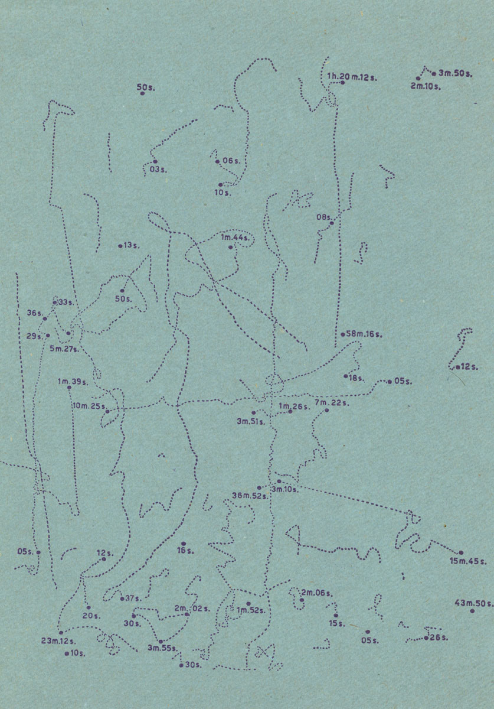

# Proyecciones e intereses respecto al cierre de TACO1222-037

Para la clase de hoy debiamos traer ideas, proyecciones y propuestas para el desarrollo de una obra que responda al curso, y que esta msima sea el Exámen final.

Cómo he comentado con anterioridad, mi busqueda por artistas mediales se ha concentrado principalmente en el NETART, diciplina en la que no hemos ahondado mucho en el curso, entendiendo que en TACO 
hemos desempeñado labores de programación más relacionadas con los disositivos físicos de la electrónica, cosa que no abunda en el NETART que, al menos, yo conozco. Por esta misma razón, me he visto en la obligción
de hacer una exploración más exaustiva en busqueda de referentes mediales que puedan inspirarme.

## Referentes

Para comenzar con mi exploración de referentes que motiven mi trabajo final de este curso he decididdo comenzar con lo más básico, recordar concientemente el título de este curso, "Del Dato al Objeto",
un nombre ficcional que hace referencia directa a cómo desde el arte visual existe la posibilidad de transmutación desde el "Dato", digase también, el univero dígital; al "Objeto" o dimensión física.

A partir de esta capacidad de convertir el "Dato" en algo más viene a mi mente dos referentes, de los cuales uno no proviene del universo artístico, sino cientifico, pero que tuvo la capacidad de graficar con fundamentos de la 
estética información en bruto.

### Harold Fisk
### Harold Fisk’s Meander Maps of the Mississippi River (1944)

Este mapa corresponde a una cartografía del geólogo estadounidense, Harold Fisk, que busca revelar el comportamiento del Rio Misisipi y las razones de los constantes aluviones que se vivian del sur 
de Illinois hasta el sur de Luisiana. Para recrear los cambios atrave del tiempo resecto al flujo original del río, Fisk tuvo la idea de hacer una superpocición de mapas ya existentes y lecturas geofísicas del terreno, difernciando
cada dato con colores, un método que además de atractivo, revolucionó la cartografía geofísica gracias a la posbilidad de hacer proyecciones de cambio y tendencias de las transformaciones naturales.

Mi interés con este mapa, además de su elemento gráfico, es el flujo de datos que conserva, pues este mapa no cumple solo la función de retratar y delimitar, sino de revelar también el flujo del tiempo, 
capaz de transmitir cierta experiencia sublime al enfrentarse de frente ante el poder de la naturaleza y la inmencidad de la temporalidad.

### Walter Marchetti
### Observación de los movimientos de una mosca sobre el cristal de una ventana desde las 8 de la mañana hasta las 7 de la tarde de un día de mayo de 1967.

Este segundo gráfico fue realizado por el artista visual, compositor y flósofo Italo-Español Walter Marchetti, perteneciente al grupo vanguardista ZAJ, un colectivo que guarda similitudes con el FLUXUS, pero con 
matices eropeos, especialmente español.
En este trabajo, Marchetti genera un gráfico a partir de la caminata por el cristal de una mosca, creando así una composición que, además de atractiva, eleva una pregunta fundamental, ¿Es acaso todo medible, graficable o 
estandariable?

Mi interés ante esta obra es la capacidad de volver lo mundano y aleatorio, como el vuelo de una mosca, en un dato con cierta relevancia con solo la utilización del lenguaje científico, como si realmente 
cualquier cosa pudiese ser importante utilizando las palabras y formas correctas.

### John Cage / Catálogo Cybernetic Serendipidity
### Extract from "A Year From Monday" (1967)

Reviando el libro Cybernetic Serendipidity me llamó la atención el gráfico de John Cage en el fragmento llamado "Extract from "A Year From Monday", siendo este una explicación detras de como fue componiendo diferentes piezas musicales utilizando lenguaje comunicacional. 

Mi interés particular es en como tiene la capacidad de deformar el lenguaje musical tradicional de las partiruras para constuir una nueva forma de graficar que responda a los parametros propios de Cage, un ejercicio parecido al que Safo de Lesbos hizo cambiando la métrica tradicional de la poesia griega tradicional de su época con el fin de evocar otras sensaciones.

### Computer Technique Group, Japan
### Selección de obras del Catálogo Cybernetic Serendipidity

El  Computer Technique Group (CTG) es un colectivo de artistas, programadores, ingenieros y arquitectos que en la década de los 60 fueron explorando la diciplina del arte medial, utilizando principalmente las herramientas del diseño gráfico.

Me llamó especialmente la atención la selección de imágenes y cómo la construcción de estas agrega una capa de sentido, especialmente en aquellas donde aparece Kennedy.

## Propuesta

Aunque aún no tengo una idea tan clara de que me gustaría hacer, la aparición de utilizar el lenguaje de la gráfica científica para construir imágenes o mensajes me parece atractivo de explorar.
Relacionando esto mismo con mis intereses generales màs allà del curso y la retórica que he estado trabajando este último tiempo, me parece pertinente integrar el desgaste de la propaganda política o la intervensión en el espacio público, especialmete la del afiche de papel que se enfrenta a la interperie.

