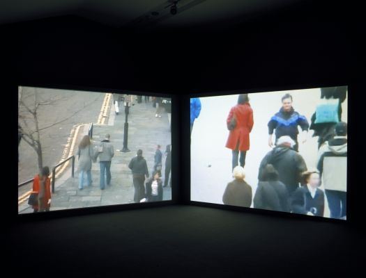
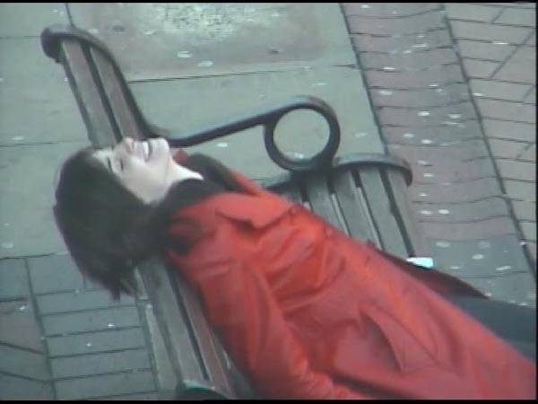

# Avances Proyecto Final

Para intentar avanzar en mi proyecto, primero debo comenzar a definir de mejor forma que es lo que llevaré a cabo como último ejercicio.

Hace dos clases propuse como interés la utilización de un gráficos o mapa como parte importante del proyecto, utilizar el lenguaje científico de la investigación para elevar datos que parecieran no ser importantes.

En esta misma línea, y profundizando el marco teórico aparecio un cncepto relevante que me interesa explorar, la **"vigilancia**, por lo que el siguiente paso fue seguir buscado referentes.

## Evidence Locker; de Jill Magid (2004)

Jill Magid por 31 días seguidos establece una elación parasocial con el guardia de seguridad de una compañia de camaras que recorre londres. Magid vestida de rojo llama a la compañia y a este sujeto mientras se ven por las cámaras.

# Fechas Exámen

Mi fecha de Exámen es el **27 de noviembre**, es decir, dos clases más aparte de esta.
