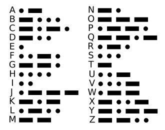

# Clase 03 / 21.08.2025
## Resumen
Comenzamos la clase con un peueño recordatorio y resolución de preguntas sobre la utilización de Github, en su mayoría son cosas que ya tengo aprendidas deste andes ya que no es mi primera vez en Github.
Principalente recordamos como crear carpetas, archivos README y pegar fotografías en estos últimos.

La siguiente parte de la clase se trató principalmente de exploraciones primarias con ARDUINO, cómo yo no traje el dispositivo, utilizaré [Tinker Card](https://www.tinkercad.com/things/1jfkEjWRtGt/editel), una página web para poder hacer circuitos de forma virtual.


Antes de comenzar con el codigo de ARDUINO, Maty explicó sobre el paradigma entre lo análogo y lo digital. 
El universo digital es conocido como el universo "discrteto", donde solo existe el estado binario cómo on/off, 1-0, High/Low.
Por otra parte, el Universo análogo o "Continuo" son gradientes, existen maticez complejos, ejemplo es que entre 0 y 1 existe infinitos números decimales.

### Arduino experimentación Básica

Ya comenzando con los ejercicios de hoy, Maty enseña a realizar un blink con el Led integrado de la targeta en forma manual. 
El codigo utilizado es:
```cpp
//Primer Ejercicio 21.08.2025
int ledPin = 13;
//Aqui combertimos el pin en una varieble que puedo 
//cambiar siempre que quieras
int tiempoOn = 100;
int tiempoOff = 100;
//Aquí convertimos el tiempo el delay como variables igual que el 
//Pin

void setup()
{
  pinMode (ledPin,OUTPUT); 
  //El pinMode define que hacen el Pin nombrado
  //si es output o input
  Serial.begin (9600);
    //9600 es un baudio, número de datos por segundo
}

void loop()
{
  digitalWrite (ledPin, HIGH);
  //"digitalWrite" se utiliza para ordenar el quehacer del pin 
  //en comportamiento digital, o séa 1 o 0
  Serial.println ("Prendio");
  //Serial.println es para que el monitor serial nos diga
  //que está sucediendo en nuestro código.
  delay (tiempoOn);
  //Paralizar el código en milisegundos
  
  digitalWrite (ledPin, LOW);
  Serial.println ("Apagao"); 
  delay (tiempoOff);
}
```
Esto es materia que ya he revisado en años anteriores con la profesora Mónica Bate en Taller Instruental el año 2023 y Taller Central 1-2 el año 2024, pero estos ejercicios me sirven para refrescar la memoria y comenzar a imaginar que haré respecto a obra.

El siguiente paso del ejercicio de hoy será escribir la letra A en Morse utilizando principalmente las ordenes "int" y "digitalWrite".

```cpp
//Hablar en Morce Ejercicio DOS 21.08.2025
int ledPin = 13;
//Siempre es el pin 13 si queremos utilizar el 
//Led adjunto a la placa
int tiempoPunto = 1000;
int separador = 500;
int tiempoRaya = 2000;
int finCaracter = 500;
//Hay 4 tiempos, el encendido del punto y raya
//El separador entre raya y punto y el fin del caracter
void setup()
{
  pinMode (ledPin,OUTPUT); 
  
  Serial.begin (9600);
    
}

void loop()
{
  digitalWrite (ledPin, HIGH);
  Serial.println ("Punto");
  delay (tiempoPunto);

  digitalWrite (ledPin, LOW);
  Serial.println ("separador"); 
  delay (separador);
  
  digitalWrite (ledPin, HIGH);
  Serial.println ("Raya");
  delay (tiempoRaya);
  
  digitalWrite (ledPin, LOW);
  Serial.println ("finCaracter"); 
  delay (separador);
}
```

Para agilizar acciones repetitiva podemos utilizar el termino "void x", donde una serie de acciones pueden reducirse a una sola indicación en el "void loop".

```cpp
int ledPin = 13;
//Los siguientes "int's" son indicadores de tiempo
int tiempoPunto = 1000;
int separador = 500;
int tiempoRaya = 2000;
int finCaracter = 500;
int espacio = 1000;

void setup()
{
    pinMode(ledPin,OUTPUT);
    //9600 es la tasa de baudo, esto permite 
  	//imprimir lo que sucede en el monitor serial
    Serial.begin(9600);
}

void loop()
{
    //El void loop indica las acciones que seguir el arduino
    //La "A" en morce es "punto-raya", así que, con los Void 
  	//Alternativos llamaré primero la acción "punto"
    punto();
    //llamamos posteriormente la funcion raya
    raya();
    //Ahora para indicar que terminé la "A"
  	//cerramos el caracter con un delay
    delay(finCaracter);
    Serial.println(" cierre");
}


void punto(){
    //este "Void alternativo" es la funcion que generará un punto
    //primero debo prender el punto
    digitalWrite(ledPin,HIGH);
    Serial.println("punto");
    //lo dejamos encendido
    delay(tiempoPunto);
    //ahora lo apagamos
    digitalWrite(ledPin,LOW);
    //finalmente un separador para darle tiempo a la siguiente acción
    delay(separador);
}

void raya(){
 	//empezamos con este void para generar una raya,
  	//Primero llamamos a la raya
    digitalWrite(ledPin,HIGH);
    Serial.println("raya");
    //esperamos el tiempo que dure raya
    delay(tiempoRaya);
    //apagamos la raya para finalizar
    digitalWrite(ledPin,LOW);
  	//Un nuevo separador para separar cada caracter
}

void o(){
  	//Con los void's de caracter ya definido, podríamos hacer 
  	//Nuevos void's hechos con estos primeros para hacer
  	//Letras definidas y que el Void loop sea más sintéticos
 raya();raya();raya();
}

	//Ahora simplemente le doy a iniciar para
	//que mi arduino grite en morse
```

## Encargo 3

Escribir con Morse los texto escogido en la Clase 01 con la luz adjunta al Arduino.



Como mi referente de texto es el **"Chacon"**, propaganda política del partido comunista, así que para cumplir con el encargo, buscare en [Twitter](https://x.com/brigadachacon/media) la cuenta oficial de la brigada y traspasaré el texto de su último registro en morse.


A continuación, el código final para la realización de este encargo.
```cpp
int ledPin = 13;
//Los siguientes "int's" son indicadores de tiempo
int tiempoPunto = 1000;
int separador = 500;
int tiempoRaya = 2000;
int finCaracter = 500;
int espacio = 1000;

void setup()
{
    pinMode(ledPin,OUTPUT);
    //9600 es la tasa de baudo, esto permite 
  	//imprimir lo que sucede en el monitor serial
    Serial.begin(9600);
}

void loop()
{
    //El void loop indica las acciones que seguir el arduino
    //El encargo pide que transforme mi referencia de texto
  	//en morse y utilice la luz integrada de arduino para comunicarlo
  	//Utilizaré void's de letras para sintetzar este void loop.
   	
  	e();l();
  	Serial.println("el");
  	delay(espacio);
  
  	p();r();e();s();i();d();e();n();t();e();
  	Serial.println("presidente");
  	delay(espacio);
  
  	d();e();
  	Serial.println("de");
  	delay(espacio);
  
  	c();h();i();l();e();
  	Serial.println("chile");
  	delay(espacio);
  
  	d();e();b();e();n();
  	Serial.println("deben");
  	delay(espacio);
  
	e();l();e();g();i();r();l();o();
  	Serial.println("elegirlo");
  	delay(espacio);
  
  	l();o();s();
  	Serial.println("los");
  	delay(espacio);
  
  	c();h();i();l();e();n();o();s();
  	Serial.println("chilenos");
  	delay(espacio);
  
 	g();a();t();o();
  	Serial.println("#");
  	delay(espacio);
  
  	p();u();n();t();o();
  	Serial.println("punto");
  	delay(espacio);
  
 	c();h();a();c();o();n();
  	Serial.println("chacon");
  	delay(espacio);
  
  	e();s();t();r();e();l();l();a();
  	Serial.println("estrella");
  	delay(espacio);
  
  	r();o();j();a();
  	Serial.println("roja");
  	delay(espacio);
  
  	Serial.println("cierre");
}


void punto(){
    //este "Void alternativo" es la funcion que generará un punto
    //primero debo prender el punto
    digitalWrite(ledPin,HIGH);
    Serial.println("punto");
    //lo dejamos encendido
    delay(tiempoPunto);
    //ahora lo apagamos
    digitalWrite(ledPin,LOW);
    //finalmente un separador para darle tiempo a la siguiente acción
    delay(separador);
}

void raya(){
 	//empezamos con este void para generar una raya,
  	//Primero llamamos a la raya
    digitalWrite(ledPin,HIGH);
    Serial.println("raya");
    //esperamos el tiempo que dure raya
    delay(tiempoRaya);
    //apagamos la raya para finalizar
    digitalWrite(ledPin,LOW);
  	//Un nuevo separador para separar cada caracter
}

void a(){
  	//A en morse es punto, raya
	punto();raya();
  	delay(finCaracter);
}

void b(){
  	//b en morse es raya y 3 puntos
	raya();punto();punto();punto();
  	delay(finCaracter);
}

void c(){
  	//c en morse es raya, punto, raya, punto
	raya();punto();raya();punto();
  	delay(finCaracter);
}

void d(){
  	//d en morse es raya, punto, punto
	raya();punto();punto();
  	delay(finCaracter);
}

void e(){
  	//e en morse es solo un punto
	punto();
  	delay(finCaracter);
}

void f(){
  	//f en morse es punto, punto, raya, punto
	punto();punto();raya();punto();
  	delay(finCaracter);
}

void g(){
  	//g en morse es raya, raya, punto
	raya();raya();punto();
  	delay(finCaracter);
}

void h(){
  	//h en morse son 4 puntos
	punto();punto();punto();punto();
  	delay(finCaracter);
}

void i(){
  	//i en morse son 2 puntos
	punto();punto();
  	delay(finCaracter);
}

void j(){
  	//j en morse es punto, raya, raya, raya
	punto();raya();raya();raya();
  	delay(finCaracter);
}

void k(){
  	//k en morse es raya, punto, raya
	raya();punto();raya();
  	delay(finCaracter);
}

void l(){
  	//l en morse es punto, raya, punto, punto
	punto();raya();punto();punto();
  	delay(finCaracter);
}

void m(){
  	//m en morse son 2 rayas
	punto();raya();punto();punto();
  	delay(finCaracter);
}

void n(){
  	//n en morse es raya, punto
	raya();punto();
  	delay(finCaracter);
}

void o(){
  	//o en morse son 3 rayas
	raya();raya();raya();
  	delay(finCaracter);
}

void p(){
  	//p en morse es punto, raya, raya, punto
	punto();raya();raya();punto();
  	delay(finCaracter);
}

void q(){
  	//q en morse es raya, raya, punto, raya
	raya();raya();punto();raya();
  	delay(finCaracter);
}

void r(){
  	//r en morse es punto, raya, punto
	punto();raya();punto();
  	delay(finCaracter);
}

void s(){
  	//s en morse es punto, punto, punto
	punto();punto();punto();
  	delay(finCaracter);
}

void t(){
  	//t en morse es solo una raya
	raya();
  	delay(finCaracter);
}

void u(){
  	//u en morse es punto, punto, raya
	punto();punto();raya();
  	delay(finCaracter);
}

void v(){
  	//v en morse es punto, punto, punto, raya
	punto();punto();punto();raya();
  	delay(finCaracter);
}

void w(){
  	//w en morse es punto, raya, raya
	punto();raya();raya();
  	delay(finCaracter);
}

void x(){
  	//w en morse es raya, punto, punto, raya
	raya();punto();punto();raya();
  	delay(finCaracter);
}

void y(){
  	//y en morse es raya, punto, raya, raya
	raya();punto();raya();raya();
  	delay(finCaracter);
}

void z(){
  	//z en morse es raya, raya, punto, punto
	raya();raya();punto();punto();
  	delay(finCaracter);
}

	//Decidí hacer en código todo el albaféto morse
	//por si en un futuro llego a utilizarlo
```
