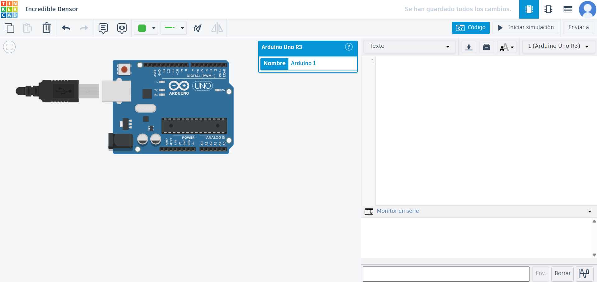

# Clase 3
## Resumen
Comenzamos la clase con un peueño recordatorio y resolución de preguntas sobre la utilización de Github, en su mayoría son cosas que ya tengo aprendidas deste andes ya que no es mi primera vez en Github.
Principalente recordamos como crear carpetas, archivos README y pegar fotografías en estos últimos.

La siguiente parte de la clase se trató principalmente de exploraciones primarias con Arduino, cómo yo no traje el dispositivo, utilizaré [Tinker Card](https://www.tinkercad.com/things/1jfkEjWRtGt/editel), una página web para poder hacer circuitos de forma virtual.

